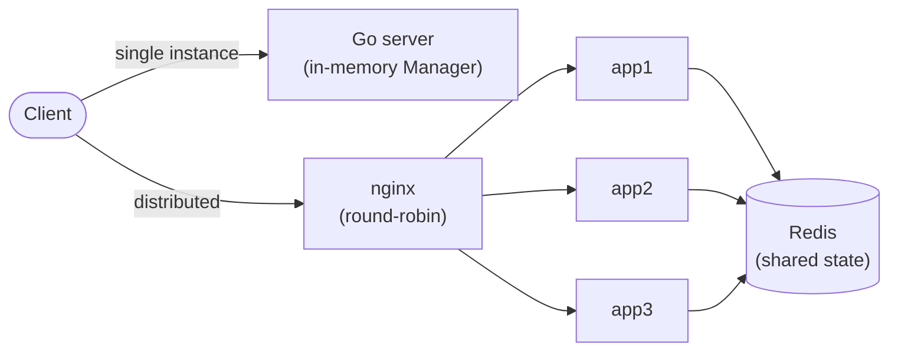

# token-bucket-rate-limiter

A standalone, networked rate-limiting service — not a library you import, but
something other services call over HTTP to ask "is client X allowed to make
this request right now?" It supports per-client configurable limits, two
interchangeable algorithms (token bucket and sliding window), state that
survives a restart, and a distributed mode where multiple instances share one
Redis-backed limit instead of each enforcing its own.

That last part is the thing that makes this more than a rate-limiting
algorithm exercise: building it as its *own service* — reachable over the
network, potentially by many callers and many instances of itself at once —
forces the real problems a rate limiter actually has to solve in production:
concurrent access to shared state, atomicity across process boundaries, and
what to do when the thing holding your state (Redis) is temporarily
unreachable. A rate-limiting *function* doesn't have any of those problems; a
rate-limiting *service* can't avoid them.

## Features

- **`GET /check/{key}`** — the core ask/answer: 200 ALLOW or 429 DENY.
- **Per-client configuration** via an admin API — set a client's rate limit
  and algorithm at runtime, no redeploy needed.
- **Two algorithms, selectable per client**: token bucket (smooth, continuous
  refill) and sliding window (blocks the double-burst a naive fixed window
  allows).
- **Standard rate-limit headers** on every response — `X-RateLimit-Limit`,
  `X-RateLimit-Remaining`, `X-RateLimit-Reset`, `Retry-After` on 429.
- **State survives a restart** — the in-memory backend periodically snapshots
  to disk and reloads it on startup.
- **Concurrency-safe** — two-level locking so unrelated clients never block
  each other; verified clean under Go's race detector.
- **Distributed mode** — any number of instances can share one rate limit
  through Redis, atomicity provided by a Lua script rather than a Go mutex
  (which can't cross process boundaries).
- **Live stats dashboard** — a small Next.js app polling `/stats` to show
  live per-client allow/deny rates.
- **Load-tested** at 500+ concurrent RPS via the bundled `loadtest` CLI, in
  both single-instance and 3-instance distributed configurations.

## Architecture



The server has exactly one job — decide allow/deny for a client — but two
ways to hold the state behind that decision, selected by the `BACKEND` env
var:

- **`memory`** (default): an in-process `Manager` holding a map of
  per-client limiters. Simplest option, fine for a single instance or local
  development, but state doesn't survive past that one process (beyond what
  the snapshot file can restore on the *same* machine).
- **`redis`**: a `RedisStore` that keeps every client's bucket state in
  Redis instead of in memory. Any number of server instances pointed at the
  same Redis enforce the *same* limit, because they're all reading and
  writing the same state — which is exactly what the diagram above is
  showing: three instances behind nginx, all sharing one Redis.

A request to `GET /check/{key}` walks the same path regardless of backend:
the HTTP handler extracts `key` from the URL, calls `store.Allow(key)` on
whichever `Store` implementation was wired up at startup, and translates the
returned `Decision` into a response — headers set from `Decision.Limit`,
`.Remaining`, `.ResetAfter` (and `.RetryAfter` on denial), status code from
`Decision.Allowed`. The handler itself never knows or cares whether that
decision came from an in-process mutex-guarded struct or a Lua script run
against Redis — that's the point of the `Store` interface.

## Project layout

```
.
├── main.go                — HTTP server entrypoint: backend selection, route registration, graceful shutdown
├── internal/limiter/      — the core: Config, Decision, TokenBucket, SlidingWindow, Manager, RedisStore, Store interface
├── internal/httpapi/      — HTTP handlers (admin, check, stats), each built only against the Store interface
├── internal/store/        — snapshot persistence: atomic save/load of PersistedState to/from a JSON file
├── loadtest/              — standalone CLI that hammers /check and reports correctness or throughput
├── deploy/                — Dockerfile, docker-compose.yml, nginx.conf for the 3-instance distributed setup
└── dashboard/             — Next.js live-stats dashboard (its own npm project, doesn't touch the Go build)
```

## Quickstart

### 1. Single instance (in-memory)

```bash
go run .
```

In another terminal, configure a client with a small burst so you can see
the limit trip quickly, then hammer it:

```bash
curl -X PUT localhost:8080/admin/clients/demo \
  -d '{"RPS":1,"Burst":3,"Algorithm":"token_bucket"}'

for i in 1 2 3 4; do curl -i localhost:8080/check/demo; echo; done
```

The first three requests come back `200 ALLOW`; the fourth flips to
`429 DENY` once the burst is spent:

```
HTTP/1.1 200 OK
X-Ratelimit-Limit: 3
X-Ratelimit-Remaining: 2
X-Ratelimit-Reset: 1
ALLOW

...

HTTP/1.1 429 Too Many Requests
Retry-After: 1
X-Ratelimit-Limit: 3
X-Ratelimit-Remaining: 0
X-Ratelimit-Reset: 1
DENY
```

### 2. Distributed (Docker Compose)

```bash
docker compose -f deploy/docker-compose.yml up --build
```

This starts Redis, three app instances (`app1`/`app2`/`app3`, all
`BACKEND=redis`), and nginx round-robining across them on host port 8080.
Configure the client once, through nginx — whichever instance handles that
request writes the config to the shared Redis, so all three see it:

```bash
curl -X PUT http://localhost:8080/admin/clients/demo \
  -d '{"RPS":1,"Burst":100,"Algorithm":"token_bucket"}'
```

Then run the load test against nginx, exactly as you would against a single
instance:

```bash
go run ./loadtest -url http://localhost:8080 -key demo \
  -mode correctness -n 5000 -c 50 -expect 100
```

Even though nginx spread those 5000 requests round-robin across three
separate processes, the result is (close to) exactly 100 allowed — the burst
you configured, not ~300 (which is what three *independent* per-process
limiters would have allowed). See [`deploy/README.md`](deploy/README.md) for
more detail and the teardown command.

### 3. Dashboard

```bash
# terminal 1 — the API (either backend works)
go run .

# terminal 2 — the dashboard
cd dashboard
npm install
npm run dev
```

Open http://localhost:3000, then generate some traffic to watch the rates
move:

```bash
go run ./loadtest -key demo -mode throughput -n 2000 -c 20
```

See [`dashboard/README.md`](dashboard/README.md) for configuring which API
the dashboard points at.

## Configuration

All configuration is via environment variables, read once at startup:

| Variable                 | Default          | Meaning                                                                 |
| ------------------------ | ---------------- | ------------------------------------------------------------------------ |
| `BACKEND`                | `memory`         | `memory` (in-process `Manager`) or `redis` (`RedisStore`)                |
| `REDIS_ADDR`             | `localhost:6379` | Redis address; only read when `BACKEND=redis`                            |
| `ADDR`                   | `:8080`          | Address the HTTP server binds to                                        |
| `SNAPSHOT_PATH`          | `state.json`     | File the memory backend persists to; only used when `BACKEND=memory`     |
| `SNAPSHOT_INTERVAL_SECS` | `5`              | How often the background snapshot loop runs; only used when `BACKEND=memory` |

## API reference

### `GET /check/{key}`

Consumes one unit of capacity from `key`'s bucket and reports the outcome.
Sets these headers on **every** response, allowed or not:

| Header                  | Meaning                                             |
| ------------------------ | ---------------------------------------------------- |
| `X-RateLimit-Limit`      | the client's configured burst capacity              |
| `X-RateLimit-Remaining`  | capacity left after this request                    |
| `X-RateLimit-Reset`      | seconds until the bucket is back to full capacity   |
| `Retry-After`            | (429 only) seconds until at least one unit is available |

Status is `200` with body `ALLOW`, or `429` with body `DENY`.

```bash
curl -i localhost:8080/check/demo
```

### `PUT /admin/clients/{key}`

Sets (or replaces) `key`'s rate-limit config. Body is JSON: `RPS` (float,
must be `> 0`), `Burst` (float, must be `>= 1`), `Algorithm`
(`"token_bucket"` or `"sliding_window"`). Returns `200` on success, `400`
with a descriptive message on an invalid body or config.

```bash
curl -X PUT localhost:8080/admin/clients/demo \
  -d '{"RPS":5,"Burst":20,"Algorithm":"sliding_window"}'
```

### `GET /admin/clients/{key}`

Returns `key`'s stored config as JSON, or `404` if none has been set (the
client would fall back to the built-in default: `RPS: 1, Burst: 5,
token_bucket`).

```bash
curl localhost:8080/admin/clients/demo
```

### `DELETE /admin/clients/{key}`

Removes `key`'s config and any in-flight limiter/bucket state. Always
returns `200`.

```bash
curl -X DELETE localhost:8080/admin/clients/demo
```

### `GET /stats`

Returns cumulative allow/deny counts for every client that has hit `/check`,
as JSON: `{"<clientID>": {"allowed": N, "denied": N}, ...}`. Sets a
permissive CORS header (see [Known limitations](#known-limitations--future-work))
so the dashboard can fetch it directly from a different origin.

```bash
curl localhost:8080/stats
```

### `GET /health`

Plain-text `200 OK` — proves the process is up and serving.

## Design decisions & tradeoffs

**Config vs. runtime state are separate.** A client's `Config` (RPS, burst,
algorithm — set via the admin API) is distinct from its live limiter state
(current token count, window position). Changing config discards the old
limiter rather than trying to migrate its state, so a client always starts
clean under new limits instead of carrying over a token count that doesn't
mean anything under the new numbers.

**Two-level locking in `Manager`.** A single map-wide lock would serialize
*every* client's requests through one bottleneck. Instead, `Manager`'s own
mutex only ever guards the get-or-create step on its maps; it's released
before calling into the per-client limiter, which has its own mutex. Two
clients' requests never wait on each other — only concurrent requests for
the *same* client do.

**Lazy refill, no background timers.** Both algorithms compute "how much
should have accrued since last time" at the moment a request arrives,
instead of running a goroutine that ticks and tops up buckets on a schedule.
No timers to leak, no clock drift between a ticker and real elapsed time,
and it trivially scales to any number of idle clients at zero cost.

**Distributed atomicity needs a Lua script, not a mutex.** A `sync.Mutex`
only protects state within one process; it's meaningless the moment two
server instances are involved. Redis, on the other hand, executes an entire
Lua script as one atomic, single-threaded operation — no other command runs
until it finishes — so running the whole refill-check-consume sequence as
one script gives multiple instances the same atomicity a mutex gives one
process, without a separate distributed lock.

**Fail closed on Redis errors.** If a `RedisStore` operation errors (network
blip, Redis down), `Allow` denies rather than allows. A rate limiter that
fails open under an outage stops protecting the thing it exists to protect
at exactly the moment protection matters most.

**Snapshot persistence trades exactness for simplicity.** The memory backend
snapshots to disk on an interval plus once on graceful shutdown — bounded,
not zero, data loss on an unclean exit (a crash between snapshots loses at
most one interval's worth of state). Redis mode has no such gap: every write
already lands in Redis.

**An injectable clock, everywhere time matters.** Both `TokenBucket` and
`SlidingWindow` take their `now func() time.Time` as a field, defaulting to
`time.Now` in production but swappable for a fully-controlled fake clock in
tests. That's what makes refill math and window-boundary behavior testable
deterministically, with zero real sleeps.

## Testing

```bash
go test ./... -race
```

Coverage spans: both algorithms' burst/refill/boundary behavior (via a fake
clock); `Manager`'s concurrency safety (a 1000-goroutine hammer test) and
config/persistence round-tripping; `RedisStore`'s Lua-scripted burst
behavior and stats (these tests dial Redis first and `t.Skip` if it's
unreachable, so the suite stays green with no Redis running); the HTTP
handlers end-to-end via `httptest`; and snapshot save/load round-tripping to
a real temp file.

The load test (`loadtest/`) provides an end-to-end correctness check beyond
unit tests: fire N requests at a configured burst and assert the allowed
count matches (within a small refill tolerance). Run against the 3-instance
distributed setup, this is the strongest evidence in the repo that the
design works — the configured limit holds even when requests are round-robin
split across independent processes, which a set of independent in-memory
limiters cannot do (see the [distributed quickstart](#2-distributed-docker-compose)
above for the actual numbers).

## Known limitations / future work

- **Sliding window isn't implemented in the Redis backend yet.** A client
  configured for `sliding_window` under `BACKEND=redis` is still rate-limited
  correctly (same RPS/burst numbers), just via the token-bucket curve
  instead — a documented, intentional gap, not a silent bug.
- **The persistence type-switches have no default case.** `Manager.Snapshot`
  and `.Restore` switch on the concrete limiter type / `Algorithm` string;
  with only two algorithms this is fine, but adding a third means remembering
  to extend both switches — nothing today would catch a forgotten case at
  compile time.
- **The dashboard's CORS is permissive** (`Access-Control-Allow-Origin: *`)
  — reasonable for a local dev dashboard reading non-sensitive counters, but
  a production deployment should scope it to the dashboard's actual origin.
- **No auth on the admin or stats endpoints.** Anyone who can reach the
  server can reconfigure any client's limits or read everyone's stats.
  Fine behind a private network for now; a real deployment needs at least
  an API key in front of `/admin/*`.
- **No metrics export beyond `/stats`.** A Prometheus `/metrics` endpoint
  (request latency histograms, allow/deny counters in Prometheus's format)
  would be a natural next addition for production observability.
